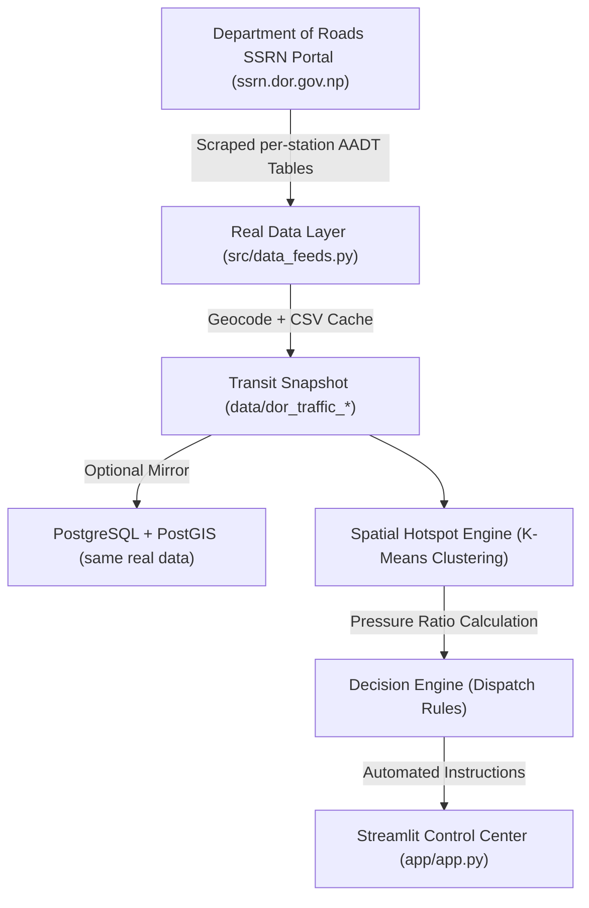

# Smart City Transit Optimization: System Architecture & Design

## 1. System Overview
The **Smart City: Dynamic Transit Scheduling and Route Optimization** system is an enterprise data engineering architecture engineered to turn **real government traffic statistics** into an adaptive dispatch network for the Kathmandu Valley, Nepal. No synthetic demand data is used anywhere.

## 2. Architectural Layers

### 2.1 Real Data Layer (`src/data_feeds.py`, `src/generate_data.py`)
- **Real Primary Source**: Department of Roads (DOR) SSRN public traffic portal — `https://ssrn.dor.gov.np/traffic_controller`.
- **Ingestion**: For each of the 21 official Kathmandu Valley count stations, the AADT summary page is fetched and parsed:
  - Station No, Road Link, Location
  - AADT (total, excluding MC & rickshaws)
  - AADT in PCUs (total, excluding MC & rickshaws), Year
- **Caching**: Real snapshots are cached as CSVs (`data/dor_traffic_demand.csv`, `data/dor_traffic_stops.csv`) to keep the dashboard fast; a forced scrape re-hits the official portal.
- **Geocoding**: Real station names are geocoded with OpenStreetMap Nominatim, with curated real reference coordinates for each station used when the service is unreachable.
- **PostgreSQL/PostGIS Mirror (optional)**: `sql/schema.sql` defines a PostGIS-schema (`bus_stops` + `dor_traffic_demand`) populated from the mirrored real rows.

### 2.2 Spatial Clustering & Dispatch Optimization Layer (`src/optimize.py`)
- **Pressure Computation**: Station hourly load (derived from the real AADT) / station capacity tier (derived from real AADT ranking) yields a per-junction pressure ratio.
- **Spatial Hotspot Clustering**: Demand-weighted K-Means clustering on the real station coordinates.
- **Automated Decision Engine**: Rule-based dispatch instructions across four alert levels (RED / AMBER / GREEN / BLUE):
  - `RED`: Critical overcrowding — inject express buses and cut headway.
  - `AMBER`: High demand — reduce headway and dispatch supplemental microbuses.
  - `GREEN`: Normal operation — maintain scheduled timetable.
  - `BLUE`: Underutilized — extend headway or re-route fleet.

### 2.3 Visualization & Control Layer (`app/app.py`)
- **Streamlit Interface**: Dark high-tech command dashboard.
- **Folium Map**: Real Kathmandu stations rendered with color-coded congestion markers and hotspot cluster polylines.
- **Analytics**: System-wide KPI cards, sortable dispatch recommendation table, live operational snapshot, and real observed traffic charts per station.

## 3. Data Provenance
| Field | Source |
|-------|--------|
| Traffic counts | Nepal DOR SSRN portal (official) |
| Coordinates | OpenStreetMap Nominatim + curated references |
| Dataset size | 21 stations × AADT figures |
| Synthetic data | None |
| Refresh | On-demand re-scrape from the official portal |