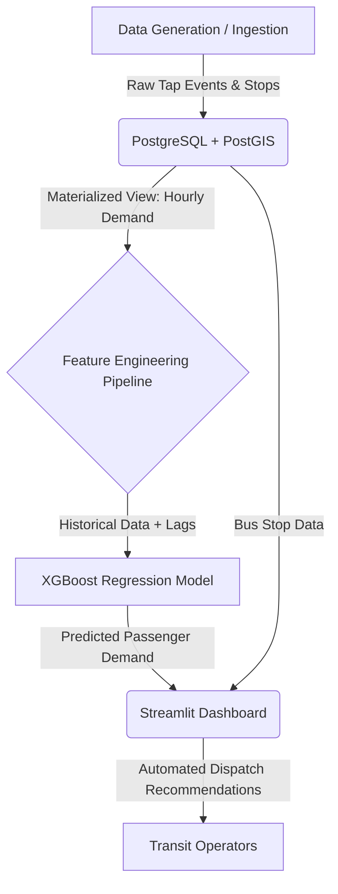

# Smart City Transit Optimization: System Architecture & Design

## 1. System Overview
The Smart City Transit Optimization system is designed to ingest real-time and historical public transit data, forecast passenger demand, and dynamically recommend schedule adjustments. It leverages a modern data stack with PostgreSQL for storage, XGBoost for predictive modeling, and Streamlit for a real-time command center interface.

## 2. High-Level Architecture
The architecture follows a modular, three-tier design:

## 3. Core Components

### 3.1 Data Layer (PostgreSQL & PostGIS)
*   **Storage engine**: PostgreSQL containerized via Docker.
*   **Spatial Extension**: PostGIS is used for spatial queries and hotspot clustering.
*   **Tables**:
    *   `bus_stops`: Master list of stops with geospatial `location` coordinates.
    *   `tap_events`: Raw granular data representing passenger boardings and alightings.
    *   `hourly_context`: Weather and temporal context (temperature, precipitation).
*   **Materialized View (`mv_hourly_stop_demand`)**: Pre-aggregates raw tap events into hourly buckets for high-performance model training and dashboard rendering.

### 3.2 Machine Learning Pipeline (Python, scikit-learn, XGBoost)
*   **Feature Engineering**: Translates raw timestamps into cyclical temporal features (hour, day, month, is_peak) and calculates historical lags (1h, 24h, 168h).
*   **Model**: `XGBRegressor` is trained to predict the total passenger demand for a specific stop in the next hour.
*   **Clustering**: `KMeans` spatial clustering identifies "hotspots" of congestion across the transit network to reroute or dispatch additional buses.

### 3.3 Application Layer (Streamlit)
*   **Command Center UI**: Provides real-time visibility into the transit network.
*   **Interactive Maps**: Uses `folium` to plot bus stops, color-coded by predicted capacity levels (RED, AMBER, GREEN).
*   **Analytics**: Visualizes historical demand trends and plots future forecasts using Plotly.

## 4. Design Decisions
*   **Materialized Views**: Chosen to reduce analytical query latency since aggregating millions of tap events in real-time is computationally expensive.
*   **XGBoost over Deep Learning**: Selected for its superior performance on tabular data with temporal/lag features, and its fast inference time on CPU.
*   **Streamlit**: Allows for rapid prototyping and deployment of a Python-based data web application without the overhead of a separate frontend framework (like React).
