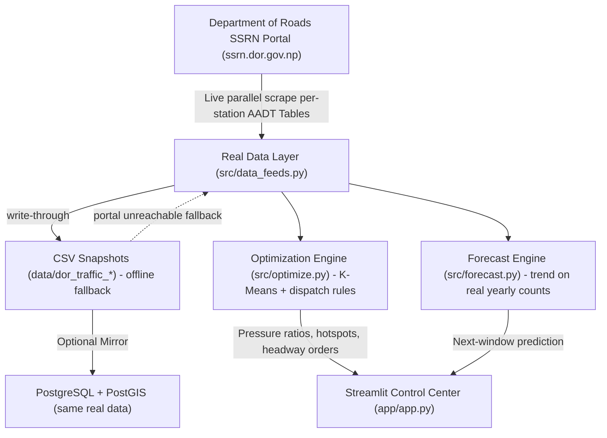

# Smart City Transit Optimization: System Architecture & Design

## 1. System Overview
The **Smart City: Dynamic Transit Scheduling and Route Optimization** system is an enterprise data engineering architecture engineered to turn **real government traffic statistics** into an adaptive dispatch network for the Kathmandu Valley, Nepal. No synthetic demand data is used anywhere.

## 2. Architectural Layers

### 2.1 Real Data Layer (`src/data_feeds.py`, `src/generate_data.py`)
- **Real Primary Source**: Department of Roads (DOR) SSRN public traffic portal — `https://ssrn.dor.gov.np/traffic_controller`.
- **Live ingestion (default)**: On startup (app or `run.py`), all 21 official Kathmandu Valley count stations are scraped **in parallel** (6 workers; every run is a fresh real scrape, no stale-cache gating). Each station's summary page is parsed into:
  - Station No, Road Link, Location
  - AADT (total, excluding MC & rickshaws)
  - AADT in PCUs (total, excluding MC & rickshaws), Year
- **Offline fallback**: every successful scrape writes real CSV snapshots (`data/dor_traffic_demand.csv`, `data/dor_traffic_stops.csv`). If the portal is unreachable, the feeds return the last snapshot and tag rows `data_source = dor_portal_snapshot` so the dashboard shows an explicit OFFLINE badge.
- **Forecasting (`src/forecast.py`)**: fits a per-station linear trend (year → aadt_pcu, scikit-learn) on the ≥4 real published yearly counts and projects the **next count window** (e.g. 2024/25 → 2026/27); stations with fewer published years are carried forward. Uncertainty (residual sigma) is computed per station.
- **PostgreSQL/PostGIS Mirror (optional)**: `sql/schema.sql` defines a PostGIS-schema (`bus_stops` + `dor_traffic_demand`) populated from the mirrored real rows.

### 2.2 Spatial Clustering & Dispatch Optimization Layer (`src/optimize.py`)
- **Pressure Computation**: Station hourly load (derived from the real AADT) / station capacity tier (derived from real AADT ranking) yields a per-junction pressure ratio.
- **Spatial Hotspot Clustering**: Demand-weighted K-Means clustering on the real station coordinates.
- **Automated Decision Engine**: Rule-based dispatch instructions across four alert levels (RED / AMBER / GREEN / BLUE):
  - `RED`: Critical overcrowding — inject express buses and cut headway.
  - `AMBER`: High demand — reduce headway and dispatch supplemental microbuses.
  - `GREEN`: Normal operation — maintain scheduled timetable.
  - `BLUE`: Underutilized — extend headway or re-route fleet.

### 2.3 Visualization & Control Layer (`app/app.py`)
- **Streamlit Interface**: dark high-tech command dashboard; live-scrapes the portal once per process (cached `st.cache_resource`, 60s page auto-refresh reads memory) with a manual *Scrape DOR Portal Now* action.
- **Folium Map**: real Kathmandu stations rendered with color-coded congestion markers and hotspot cluster polylines.
- **Analytics**: system-wide KPI cards, sortable dispatch recommendation table, live operational snapshot (LIVE / OFFLINE badge + fetched timestamp), per-station traffic charts with a **dashed forecast extension**, and a next-window forecast panel (total growth, fastest-growing station, station table with Delta % and model type).

## 3. Data Provenance
| Field | Source |
|-------|--------|
| Traffic counts | Nepal DOR SSRN portal (official), scraped live at each run |
| Forecast | Linear trend trained only on the real published yearly counts |
| Coordinates | Official station metadata in the scraped tables |
| Dataset size | 21 stations × AADT figures × all published years |
| Synthetic data | None |
| Refresh | On-demand live scrape from the official portal; dashboard fallback to last real snapshot (explicit OFFLINE badge) |