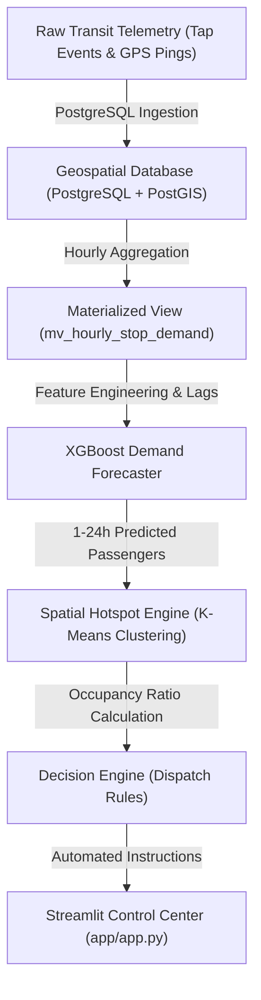

# Smart City Transit Optimization: System Architecture & Design

## 1. System Overview
The **Smart City: Dynamic Transit Scheduling and Route Optimization** system is an enterprise data science architecture engineered to transform static transit scheduling into an adaptive dispatch network for South Asian urban corridors like the Kathmandu Valley.

## 2. Architectural Layers

### 2.1 Geospatial Data Layer (`sql/schema.sql`)
- **Database Engine**: PostgreSQL with PostGIS extension.
- **Tables**:
  - `bus_stops`: Master stop definitions with PostGIS `GEOMETRY(Point, 4326)` centered on Nepal coordinates (~27.7172 N, 85.3240 E).
  - `tap_events`: Granular passenger card entry and exit timestamps.
  - `vehicle_gps`: Real-time vehicle telemetry (`vehicle_id`, `current_occupancy`, `speed_kmh`, `location`).
  - `environmental_context`: Temperature, precipitation, Nepal Saturday weekend flags, and festival season indicators.
- **Indexing**: GIST spatial indexes on geometry columns for fast spatial proximity queries (`ST_DWithin`).
- **Materialized View**: `mv_hourly_stop_demand` aggregates raw tap logs into hourly passenger flow windows per stop.

### 2.2 Machine Learning & Feature Engineering Layer (`src/train_model.py`)
- **Features**:
  - Temporal: Hour of day, day of week, Nepal Saturday weekend flag (Saturday=1, Sunday=0), morning/evening rush hour flags, Dashain/Tihar festival flags.
  - Environmental: Temperature, precipitation, heavy monsoon precipitation flag (>2.0 mm/hr).
  - Time-series Lags: 1-hour, 24-hour, 168-hour (1-week) lags, 3-hour rolling mean, 24-hour rolling mean.
- **Model**: `XGBRegressor` forecasting hourly passenger demand.
- **Validation**: Chronological 80/20 train/test split evaluated via RMSE and MAE.

### 2.3 Spatial Clustering & Dispatch Optimization Layer (`src/optimize.py`)
- **Occupancy Computation**: Compares forecasted passenger demand against Nepal vehicle capacities (15-20 microbus vs 40-60 Sajha Yatayat bus).
- **Spatial Hotspot Clustering**: Demand-weighted K-Means clustering on stop spatial coordinates (`latitude`, `longitude`).
- **Automated Decision Engine**: Generates real-time dispatch commands for transit operators.

### 2.4 Visualization & Control Layer (`app/app.py`)
- **Streamlit Interface**: Dark high-tech dashboard for transit managers.
- **Folium Map**: Rendered map centered on Kathmandu Valley with color-coded stop congestion markers and cluster polylines.
- **Analytics**: System-wide KPI cards, sortable dispatch recommendation table, and Plotly historical/forecast trend chart.
